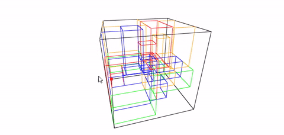

# BoxPacking: R package for solving three-dimensional bin packing problem

Dans cette partie, nous tentons de résoudre le problème du bin packing en utilisant le langage R comme méthode d'approche. L'idée reste de pouvoir obtenir une visualisation 3D du placement des colis au sein d'un container suivant les dimensions de l'ensemble des colis et du container et le poids des colis. 

Dans un premier temps, installer R et R-Studio. Vous pouvez suivre le lien suivant afin d'obtenir la dernière version des 2 outils : https://posit.co/download/rstudio-desktop/ . Une fois installés, télécharger le repo Github et ouvrez l'application RStudio. Cliquez sur 'File' > 'Open Project...'

Sélectionnez le projet R dont l'extension est .Rproj et cliquez sur 'Open'

Une nouvelle fenêtre va s'ouvrir avec une console ainsi que l'arborescence de votre projet. 

1 fichier .R est disponible. Ce fichier contient l'ensemble de nos travaux sur le sujet. Vous aurez donc accès au code permettant l'affichage du chargement d'un container suivant les caractéristiques des colis et du dit container mentionnés dans les fichiers présents dans le dossier Data_for_study. Ouvre le ficher et Faites CTRL+A puis CTRL+ENTER afin de lancer l'exéctuion de l'archive. Les différentes librairies et les différents packages nécessaires au bon fonctionnement du repository se lanceront automatiquement.

Dans les fichiers de données, vous retrouverez les infos suivantes :
oid : order id (id de la commande)
tid : ticket id (un identifiant unique contenu dans chaque commande et permettant d'indiquer dans quel container est attendu le paquet)
otid : order x ticket id
sku : numéro du packet
x, y, z : coordonnées souhaitées du paquet dans le container
l : longueur du paquet
d : largeur du paquet
h : hauteur du paquet
w : poids du paquet

Une nouvelle fenêtre s'ouvrira une fois l'application terminée. La sortie de l'application aura donc un aperçu de ce type :

Vous pouvez modifier le numéro du container observé en changeant le numéro contenu dans la variable **containers_select = results[results$tid=="1",]** ligne 61 du code.
Vous pouvez également modifier les dimensions du container en changeant le contenu l (longueur du container), d (largeur du container), h (hauteur du container), w (poids du container) de la table bn (ligne 74 à 80 du code) : 
bn <- data.table::data.table(
    id = c(containers_select$tid),
    l  = c(12032),
    d  = c(2350),
    h  = c(2698),
    w  = c(100000)
)

Attention, il est possible qu'aucun aperçu ne soit généré car les dimensions renseignées pour le container ne permettent pas de stocker les paquets ! Donc, bien vérifier les dimensions du container avant de les saisir.
